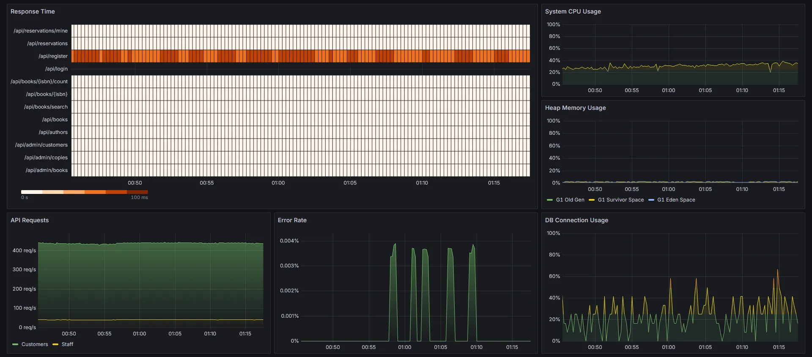

# Library Management System

A library management system built with Spring Boot, featuring public book catalog
browsing, customer self-service reservations, librarian workflow management,
role-based authentication, and real-time monitoring.

## Features

- Book management with ISBN validation and author relationships
- Author management with many-to-many relationships to books
- Copy tracking with status management (available, borrowed, reserved, lost)
- Customer management with email validation
- Borrowing and reservation system
- Authentication and authorization with Spring Security
- Password hashing and secure user management
- Search functionality across books, copies and authors
- Application monitoring with Prometheus and Grafana
- +80% test coverage with comprehensive integration and unit testing

## Tech Stack

- Java 21 + Spring Boot 3.5.0
- JPA/Hibernate with PostgreSQL
- Spring Security for authentication and role-based authorization
- Slf4j + Logback for logging
- Prometheus for metrics collection
- Grafana for monitoring dashboards
- Docker Compose for containerization
- Swagger for API documentation
- Caffeine for caching
- JUnit 5 + MockMvc for testing
- Undertow web server
- Maven

## Starting Guide

```bash
# Clone environment
cp .env.example .env
# Edit .env with your database credentials. For example:
# POSTGRES_USER=library_admin
# POSTGRES_PASSWORD=secret123
# POSTGRES_DB=library_db

# Start all services
docker-compose up
```

The application runs on `http://localhost:8080`. API documentation is available
at http://localhost:8080/swagger-ui.html.
Monitoring dashboard is available
via Grafana and Prometheus.

## Monitoring Setup Guide

1. Visit Grafana at `http://localhost:3000` (admin/admin)
2. Create a new data source:
    - Type: Prometheus
    - URL: `http://prometheus:9090`
    - Use default settings for everything else
3. Click "Save & Test"
4. Import dashboard from `grafana/dashboard.json`
5. Select the created Prometheus data source
6. Generate sample data by running `exampleRequests/complete-workflow.http`


Grafana dashboard screenshot during high load simulation using the config in `grafana/dashboard.json`.

## API Overview

Full API Documentation and details are available at http://localhost:8080/swagger-ui.html. The API is organized into
four main areas:

### Public Browsing (No Authentication Required)

Browse books and authors, search the catalog, check what's available

### Customer Self-Service (CUSTOMER role)

Create, view and cancel your reservations

### Desk Operations (LIBRARIAN role)

Handle checkouts, returns, and mark items as lost. Create "offline" customer accounts for walk-in users.

### Admin Operations (LIBRARIAN role)

Manage books, copies, and customer accounts

## Example HTTP Requests

The `exampleRequests` directory contains ready-to-use HTTP requests:

```
exampleRequests/
├── admin/
│   ├── books.http        # Book CRUD operations
│   ├── copies.http       # Copy management
│   └── customers.http    # Customer management
├── customer/
│   └── reservations.http # Customer self-service
├── librarian/
│   └── desk.http        # Desk operations
├── public/
│   ├── auth.http        # Authentication flows
│   └── browse.http      # Public browsing
└── complete-workflow.http # Full use case example
```

## Progress

- [x] Basic book CRUD operations
- [x] ISBN regex validation and duplicate prevention
- [x] Many-to-many author-book relationships with author duplicate prevention
- [x] Book search by title, author, year, ISBN
- [x] Copy status tracking (available, borrowed, reserved, lost)
- [x] State transition validation for copies
- [x] Comprehensive test coverage written while procrastinating adding new features (ongoing)
- [x] Customer management
- [x] Borrowing and reservation system with customers
- [x] Authentication and authorization with Spring Security
- [x] Password hashing and secure user management
- [x] Role-based access control (Librarian vs Customer)
- [x] Centralized messages
- [x] Proper separation of admin, desk, and customer endpoints
- [x] PostgreSQL migration from H2
- [x] Docker support
- [x] Application monitoring with Prometheus and Grafana
- [x] Custom dashboard in Grafana
- [x] Proper API documentation
- [x] Caching
- [x] Logs in JSON format with MDC
- [ ] Admin panel in Thymeleaf
- [ ] Forms for full CRUD operations on resources
- [ ] Enhance admin panel with HTMX
- [ ] CI
- [ ] Deployment